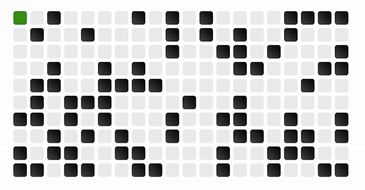

# Graph Algorithm Visualizer

## Basic Use:

This visualizer currently has 2 algorithms:

- Depth-first Search
- Breadth-first Search

Each of these algorithms occupies a section of the application and isintended to be explored modularly. For each algorithm, a group of options is presented to the user, mostly relating to the structure of a matrix or graph. These options will allow the user to mess around with the algorithm, test edge cases, and understand the core of how the algorithm works in a visual context.

### Matrix-based Algorithms:

Searching in an empty matrix is kind of boring. There will always be a way to get to the end, whether it be traversing every element of the matrix, or simply going through the perimeter.

As of now, we have the following options for our matrix operations:

- _Rows:_ This controls the number of rows in the matrix
- _Columns:_ This controls the number of columns in the matrix

Animation Speed: This controls the multiplier, from 0.25x to 2x of a speed of 4 operations/sec
Show Numbers: If interested in the paths being traversed, a user could enable the number count, where each traversed grid item would display its ordering in its path.

In these modules, you are able to visualize a standard search through a partially blocked matrix using a specified method. A general rule of thumb: depth-first search is good to verify the existance of a path and breadth-first search is good to find the shortest path.

### Specialized Matrix Algorithms

In addition to the standard implementations of DFS and BFS, I have also added a few specialized implementations of these algorithms. These implementations can be seen widely in competitive programming, interview problems, and even real-world applications.

The current specializations of DFS and BFS in this application are:

- _Word Search:_ Searching for an ASCII string within a matrix only using standard vertical or horizontal movements
- _BFS Shortest Path (similar to Dijkstra's)_ Finding the shortest path traversal through a graph using BFS
  - Demo: 

Don't forget to have fun with it!

Srikant Vasudevan :)
